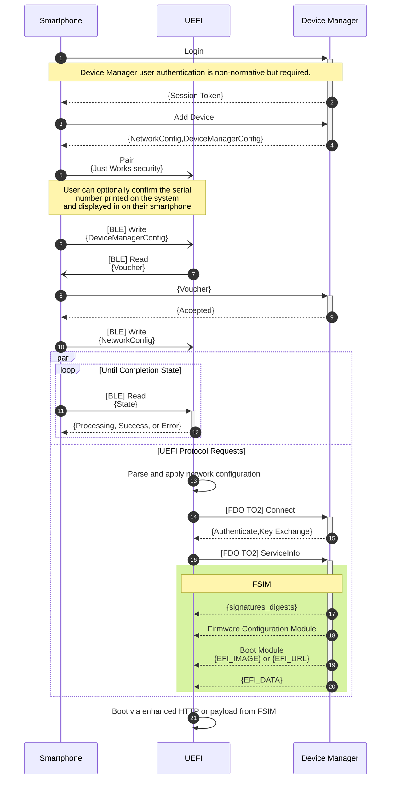
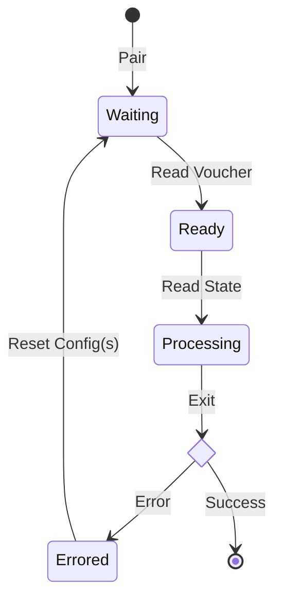
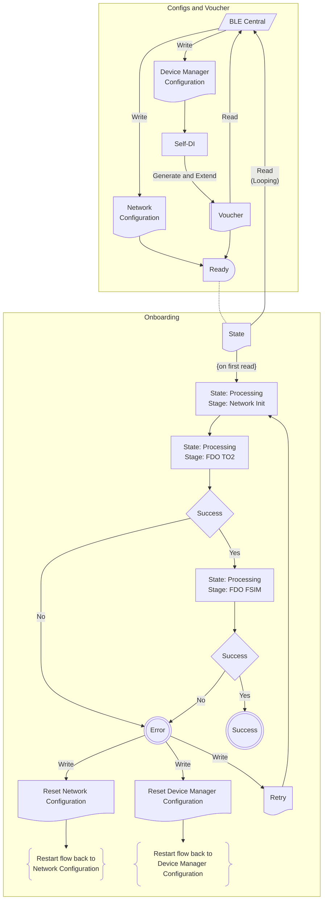

# Specification

Copyright (c) 2025 Intel Corporation.

Licensed under the Apache License, Version 2.0. See the [LICENSE](LICENSE) and [NOTICE](NOTICE) files for details.

This document is a UEFI firmware specification for BLE and FIDO Device Onboard (FDO) based configuration and onboarding.

> [!NOTE]
> This is a DRAFT specification.

## Objectives

1. Establish control between entities that have no prior knowledge or trust of each other
1. Manage firmware configuration, including platform root of trust
1. Exchange secrets securely
1. Delegate to any device-manager¹ conforming to the onboarding API

All of the above must be achievable while also significantly reducing the required skillets of the person placing the device in its operational location.

> ¹ A device manager is responsible for operational management of a system. As an example, a device manager can install or boot an operating system as the first step it performs.

Operational benefits are focused around simplicity and a reduction in Total Cost of Ownership (TCO), capturing not just the capital equipment costs, but all operational costs and complexity to bring a system into production and operate it. This includes:

- Removing IT tasks from manufacturers, integrators, and on-site technicians
- Providing the minimum onboarding logic in firmware to eliminate additional pre-deployment staging or imaging
- Standardizing lower level firmware and boot interfaces across heterogeneous systems

> [!NOTE]
> Onboarding, provisioning, and management can be be conflated into the same problem and solution (albeit clearly related). The onboarding capabilities herein are focused on the lower layers, namely establishment of ownership and control for onboarding, before OS installation starts.

## Deployment Sequence

> Reference the [GATT Specification](#gatt-specification) for specific behaviors under error conditions.



### States

The BLE sequence has finite states that can be identified by reading the `State` characteristic.



### Flows

> [!Caution]
> The voucher is created using properties from the _Device Manager Config_, so any changes to the configuration will result in a new voucher.



## GATT Specification

### Attribute Protocol

Attribute Structure:

| Attribute Handle | Attribute Type | Attribute Value | Attribute Permissions     |
| ---------------- | -------------- | --------------- | ------------------------- |
| 2 Octets         | 2 or 16 Octets | Variable length | Varies based on attribute |

The absolute maximum size of a Characteristic is 512 bytes, however the observed MTU across heterogeneous servers and clients is 20 bytes. Some mobile device manufacturers limit the MTU to 185 bytes, allowing for up to 251 bytes using Bluetooth 4.2 Data Packet Length Extension (DPLE).

Accordingly implementations require a data chunking abstraction for payloads exceeding 20 bytes.

The implementation **requires** that vendors comply to the 4.2 or higher Bluetooth specification.

### 1. Service

TODO: Register SIG attribute type for UEFI BLE-FDO Onboarding

| Vendor-specific UUID                 | Description  |
| ------------------------------------ | ------------ |
| 88f7265a-32bd-4590-a184-b046cb3955ee | UEFI Onboard |

### 2. Characteristics

From a design principle, there is a design correlation between RPCs and characteristics. For example, a `GetNetworkConfig` RPC correlates to a `NetworkConfig` characteristic.

All characteristics are `CBOR` encoded. See the [CBOR schemas](#3-cbor) section for data models.

#### 2.1 Network Configuration

| Characteristic UUID                 |
| ----------------------------------- |
| 0000210-32bd-4590-a184-b046cb3955ee |

| Field | Data Type | Size (octets) |      Properties      | Description                        |
| ----- | :-------: | :-----------: | :------------------: | ---------------------------------- |
| CBOR  |   uint8   |   variable    | WriteWithoutResponse | CBOR Encoded Network Configuration |

#### 2.1.1 Reset Network Configuration

| Characteristic UUID                  |
| ------------------------------------ |
| 00000211-32bd-4590-a184-b046cb3955ee |

| Field                       | Data Type | Size (octets) | Properties | Description                 |
| --------------------------- | :-------: | :-----------: | :--------: | --------------------------- |
| Reset Network Configuration |   uint8   |       1       |   Write    | Clear network configuration |

#### 2.2 Device Manager Configuration

| Characteristic UUID                 |
| ----------------------------------- |
| 0000220-32bd-4590-a184-b046cb3955ee |

| Field | Data Type | Size (octets) |      Properties      | Description                        |
| ----- | :-------: | :-----------: | :------------------: | ---------------------------------- |
| CBOR  |   uint8   |   variable    | WriteWithoutResponse | CBOR Encoded Network Configuration |

#### 2.2.1 Reset Device Manager Configuration

| Characteristic UUID                  |
| ------------------------------------ |
| 00000221-32bd-4590-a184-b046cb3955ee |

| Field                              | Data Type | Size (octets) | Properties | Description                 |
| ---------------------------------- | :-------: | :-----------: | :--------: | --------------------------- |
| Reset Device Manager Configuration |   uint8   |       1       |   Write    | Clear network configuration |

#### 2.3 FDO Voucher

After receiving a device manager configuration the FDO self-Device-Initialization (self-DI) will be performed.

If the voucher characteristic is read prior to the voucher creation process completion, the response will include an error tag.

| Characteristic UUID                 |
| ----------------------------------- |
| 0000230-32bd-4590-a184-b046cb3955ee |

| Field | Data Type | Size (octets) | Properties | Description                                |
| ----- | :-------: | :-----------: | :--------: | ------------------------------------------ |
| CBOR  |   uint8   |   variable    |    Read    | [CBOR tagged FDO Voucher](#35-fdo-voucher) |

#### 2.3 State

The Network Configuration and Device Manager Configuration may be delivered out of order and may be arbitrarily reset. UEFI will not attempt to initiate an onboarding request until a poll of the `State` characteristic has been initiated to view the status of the request.

Once polling has been initiated, UEFI will first apply the Network Configuration and then attempt to onboard to the device manager using the Device Manager configuration. UEFI will either return success or an error that can occur at any point of the sequence. UEFI MAY return a status indicating that a request is still in process. UEFI will NOT retry any steps of the sequence. In the event of an error, the client MAY issue a [Retry](#24-retry) or the client MAY reset and write the Network and/or Device Manager configuration with any required corrections.

| Characteristic UUID                 |
| ----------------------------------- |
| 0000230-32bd-4590-a184-b046cb3955ee |

| Field | Data Type | Size (octets) | Properties | Description         |
| ----- | :-------: | :-----------: | :--------: | ------------------- |
| CBOR  |   uint8   |   variable    |    Read    | CBOR Encoded Status |

#### 2.4 Retry

Request UEFI to repeat the onboarding sequence. UEFI will discard any bytes received for this characteristic, so a client SHOULD write 0 bytes.

| Characteristic UUID                 |
| ----------------------------------- |
| 0000240-32bd-4590-a184-b046cb3955ee |

| Field | Data Type | Size (octets) | Properties | Description                 |
| ----- | :-------: | :-----------: | :--------: | --------------------------- |
| CBOR  |   uint8   |       1       |   Write    | Restart onboarding sequence |

#### 2.5 Diagnostics

Characteristics that may be read for additional troubleshooting or context.

#### 2.5.1 Network Properties

| Characteristic UUID                 |
| ----------------------------------- |
| 0002501-32bd-4590-a184-b046cb3955ee |

| Field | Data Type | Size (octets) | Properties | Description                     |
| ----- | :-------: | :-----------: | :--------: | ------------------------------- |
| CBOR  |   uint8   |   variable    |    Read    | CBOR Encoded Network Properties |

#### 2.5.2 Network Diagnostics

Reading this characteristic will trigger UEFI to execute a series of checks and provide the response as a flag.

| Characteristic UUID                 |
| ----------------------------------- |
| 0002502-32bd-4590-a184-b046cb3955ee |

| Field | Data Type | Size (octets) | Properties | Description         |
| ----- | :-------: | :-----------: | :--------: | ------------------- |
| Flag  |  uint64   |       8       |    Read    | Network Diagnostics |

|  Bit  | Category | Description                               |
| :---: | -------- | ----------------------------------------- |
|   0   | IP       | Gateway ICMP Echo response                |
|   1   | IP       | Destination¹ ICMP Echo response           |
|   2   | IP       | Destination¹ TCP Ack                      |
|   3   | DNS      | DNS Server ICMP Echo response             |
|   4   | DNS      | NTP FQDN: Non-existent domain             |
|   5   | DNS      | NTP FQDN: No answers in response          |
|   6   | DNS      | NTP IP address answer received            |
|   7   | DNS      | Destination¹ FQDN: Non-existent domain    |
|   8   | DNS      | Destination¹ FQDN: No answers in response |
|   9   | DNS      | Destination¹ FQDN: response received      |
|  10   | NTP      | Time synchronized                         |
| 11-63 | N/A      | Reserved for future use                   |

> ¹ Destination refers to either the network Proxy or Device Manager, whichever comes first.

### 3. CBOR

All CBOR schemas use [RFC8610 CDDL](https://datatracker.ietf.org/doc/html/rfc8610).

#### 3.1 Network Configuration

```cddl
NetworkConfig = {
    proxy: - ProxyConfig
    ssid:  - string         ; SSID as a UTF8 string
    auth:  [* AuthProtocol]
    hosts: [* HostsEntry]
}

ProxyConfig = {
    httpProxy:  [+ string]  ; One or more proxy expressions as a UTF8 string
    httpsProxy: [+ string]  ;
    noProxy:    [+ string]  ;
}
```

##### 3.1.1 Authentication Configuration

A client (BT central) may send zero or many authentication protocols to the server (BT peripheral).

If multiple authentication types are received, the server shall attempt using the method in the following order:

| Order | Type | Protocol Name         | CDDL       | Description                                                     |
| :---: | :--: | --------------------- | ---------- | --------------------------------------------------------------- |
|  1.   | 0x01 | EAP-TLS               | EAPTLS     |                                                                 |
|  2.   | 0x02 | EAP-TTLS              | EAPTLS     | Tunneled Transport Layer Security                               |
|  3.   | 0x03 | EAP-PEAP GTC          | EAPPEAPGTC | Generic Token Card, one-time password                           |
|  4.   | 0x04 | EAP-PEAP PAP          | EAPPEAPPAP | Password Authentication Protocol                                |
|  5.   | 0x05 | EAP-PEAP EAP-MSCHAPv2 |            | Combination of EAP and MSCHAPv2                                 |
|  6.   | 0x06 | EAP-PEAP MSCHAPv2     |            | Microsoft Challenge Handshake Authentication Protocol Version 2 |
|  7.   | 0x09 | PSK                   | PSK        | Pre-shared Key, such as WPA2-Personal                           |

```cddl
AuthProtocol = {
    type: int            ; Auth type identifier
    data: bytes          ; Auth data for given type
}
```

##### 3.1.1 Authentication Protocols

```cddl
EAPTLS = {
    radiusCert:  bytes   ; DER encoded RADIUS X.509 server certificate
    certificate: bytes   ; DER encoded X509 client certificate to use for authentication to RADIUS server
    privateKey:  bytes   ; ECC or RSA client private key to use for authentication to RADIUS server
}

EAPPEAPGTC = {
    radiusCert: bytes    ; DER encoded RADIUS X.509 server certificate
    token:      bytes    ; RADIUS on-time token
}

EAPPEAPPAP = {
    radiusCert: bytes    ; DER encoded RADIUS X.509 server certificate
    username:   string   ; RADIUS username as a UTF8 string
    password:   string   ; RADIUS password as a UTF8 string
}

PSK = {
    passphrase: string   ; Shared key as a UTF8 string
}

```

#### 3.1.2 Host Entries

Identities SHOULD use a domain name and not IP addresses to prevent brittle configurations and to avoid identity check bypass scenarios.

In some environments a system may not have access to DNS services, or domain names may not be publicly resolvable. In either case, individual host entries can be supplied so that domain names in certificates, URLs, and other configurations can remain unchanged.

```cddl
HostsEntry = {
    addr:     string     ; IPv4 or IPv6 address as a UTF8 string
    hostname: string     ; Domain name as a UTF8 string conforming to HOSTS(5) specification
}
```

#### 3.2 Device Manager Configuration

```cddl
DeviceManager = {
    url:     string      ; Device manager scheme name string and URI as a UTF-8 string
    token:   bytes       ; Hex encoded HTTP Authentication token
    caChain: bytes       ; DER encoded X509 certificate chain of trusted TLS root Certificate Authorities
}

```

#### 3.3 Onboarding Status

```cddl
OnboardingStatus = {
    code:    uint        ; 16-bit status code
    message: string      ; Optional error message as a UTF-8 string
}
```

Status codes less than 10,000 correspond to internal errors.

| Code  | Description                                         |
| :---: | --------------------------------------------------- |
|   0   | Awaiting configurations                             |
|  100  | Parsed configurations                               |
|  200  | Network configuration applied successfully          |
|  201  | Network authentication successful                   |
|  202  | Network IP address received                         |
|  300  | Device manager name resolution successful           |
|  400  | Device Manager TO2 handshake successful             |
|  500  | Host properties received by Device Manager          |
|  600  | Firmware configuration received from Device Manager |
|  700  | Firmware configuration applied                      |
| 1000  | Onboarding Complete                                 |
| 2XXX  | Network Configuration errors                        |
| 3XXX  | Device Manager Configuration errors                 |
| 4XXX  | Firmware Configuration errors                       |
| 11XXX | Error sending host properties to device manager     |
| 12XXX | Error retrieving firmware configuration             |

#### 3.4 Diagnostics

##### 3.4.1 Network Properties

```cddl
NetworkState = {
    addr:    biguint     ; 128-bit IP address (IPv4 or IPv6)
    gateway: biguint     ; 128-bit IP address (IPv4 or IPv6)
    dns:     [+ biguint] ; One or more 128-bit DNS server IP addresses
    ntp:     [+ biguint] ; One or more 128-bit DNS server IP addresses
    time:    int         ; 64-bit Unix epoch time
}
```

#### 3.5 FDO Voucher

```cddl
Voucher = {
    tag:  uint   ; 8-bit tag
    data: bytes
}
```

| Code | Description  |
| :--: | ------------ |
|  1   | Error String |
|  2   | Voucher      |

## Terms

| Acronym | Full Form                                   |
| ------- | ------------------------------------------- |
| BLE     | Bluetooth Low Energy                        |
| NFC     | Near Field Communication                    |
| DPP     | (Wi-Fi Direct) Device Provisioning Protocol |
