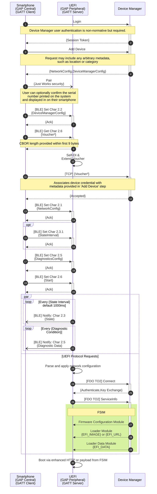
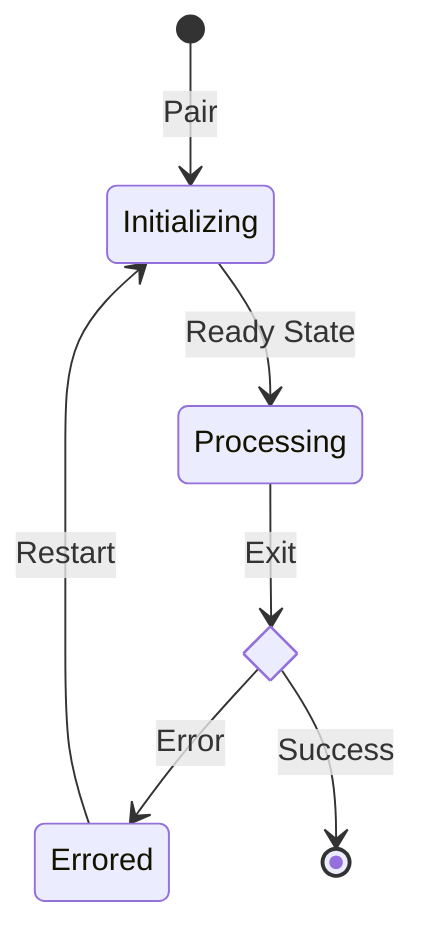
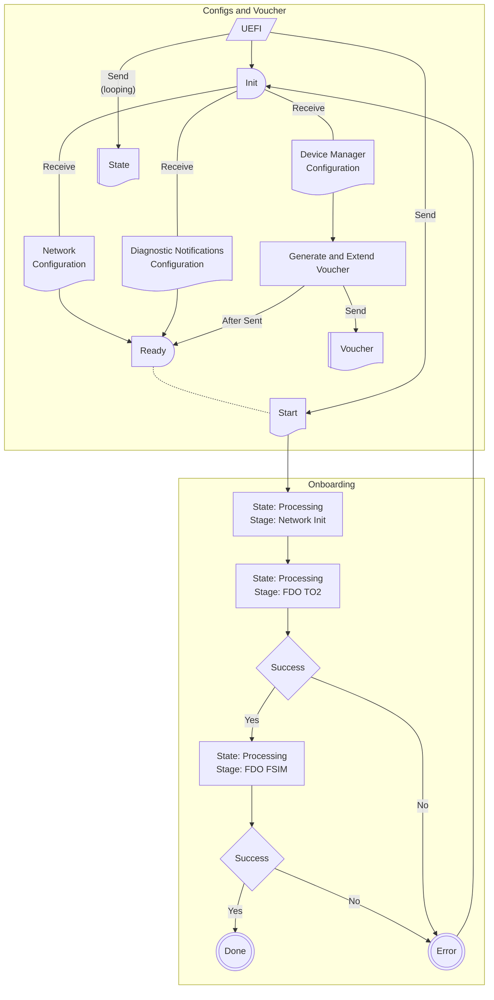

# Specification

Copyright (c) 2025 Intel Corporation.

Licensed under the Apache License, Version 2.0. See the [LICENSE](LICENSE) and [NOTICE](NOTICE) files for details.

This document is a UEFI firmware specification for BLE and FIDO Device Onboard (FDO) based configuration and onboarding.

> [!NOTE]
> This is a DRAFT specification.

## Objectives

1. Establish control between entities that have no prior knowledge or trust of each other
1. Manage firmware configuration, including platform root of trust
1. Exchange secrets securely
1. Delegate to any device-manager¹ conforming to the onboarding API

All of the above must be achievable while also significantly reducing the required skill sets of the person placing the device in its operational location.

> ¹ A device manager is responsible for operational management of a system. As an example, a device manager can install or boot an operating system as the first step it performs.

Operational benefits are focused around simplicity and a reduction in Total Cost of Ownership (TCO), capturing not just the capital equipment costs, but all operational costs and complexity to bring a system into production and operate it. This includes:

- Removing IT tasks from manufacturers, integrators, and on-site technicians
- Providing the minimum onboarding logic in firmware to eliminate additional pre-deployment staging or imaging
- Standardizing lower level firmware and boot interfaces across heterogeneous systems

> [!NOTE]
> Onboarding, provisioning, and management can be conflated into the same problem and solution (albeit clearly related). The onboarding capabilities herein are focused on the lower layers, namely establishment of ownership and control for onboarding, before OS installation starts.

## Components

There are three major components that are involved to onboard a device:

- User Equipment (mobile phone, tablet, laptop, etc.)
- Device to be onboarded
- Device Manager, such as a cloud hosted service

## Limitations

The following are known and accepted limitations for the minimum viable product:

- UEFI does not currently support [802.3ad](https://www.ieee802.org/3/hssg/public/apr07/frazier_01_0407.pdf) link aggregation
- Firmware configuration module is only able to apply firmware configurations that do not require a soft reset

## Deployment Sequence

> Reference the [GATT Specification](#gatt-specification) for specific behaviors under error conditions.


```mermaid
sequenceDiagram
    participant ue as Smartphone<br/>(GAP Central)<br/>(GATT Client)
    participant uefi as UEFI<br/>(GAP Peripheral)<br/>(GATT Server)
    participant dm as Device Manager

    autonumber

    ue ->>+ dm: Login
    note over ue,dm: Device Manager user authentication is non-normative but required.
    dm -->> ue: {Session Token}
    ue ->> dm: Add Device
    note over ue,dm: Request may include any arbitrary metadata,<br/>such as location or category
    dm -->>- ue: {NetworkConfig,DeviceManagerConfig}

    ue -) uefi: Pair<br>{Just Works security}
    note over ue, uefi: User can optionally confirm the serial<br/>number printed on the system<br/>and displayed in on their smartphone

    ue ->>+ uefi: [BLE] Set Char 2.2<br/>{DeviceManagerConfig}
    uefi -->>- ue: {Ack}

    ue ->>+ uefi: [BLE] Get Char 2.6<br/>{Voucher²}
    note over ue,uefi: CBOR length provided within first 9 bytes
    uefi -->>- ue: 

    uefi ->> uefi: Self-DI &<br/> Extend Voucher

    ue ->>+ dm: [TCP] {Voucher²}
    note over ue, dm: Associates device credential with<br/>metadata provided in 'Add Device' step
    dm -->>- ue: {Accepted}

    ue ->>+ uefi: [BLE] Set Char 2.1<br/>{NetworkConfig}
    uefi -->>- ue: {Ack}

    opt
    ue ->>+ uefi: [BLE] Set Char 2.3.1<br/>{StateInterval}
    uefi -->>- ue: {Ack}
    end

    ue ->>+ uefi: [BLE] Set Char 2.5<br/>{DiagnosticsConfig}
    uefi -->>- ue: {Ack}

    ue ->>+ uefi: [BLE] Set Char 2.6<br/>{Start}
    uefi -->>- ue: {Ack}

    par
        loop Every {State Interval}<br/>default 1000ms
        uefi -) ue: [BLE] Notify: Char 2.3<br/>{State}
        end
        loop Every {Diagnostic Condition}
        uefi -) ue: [BLE] Notify: Char 2.5<br/>{Diagnostic Data}
        end
    and UEFI Protocol Requests
        uefi ->> uefi: Parse and apply network configuration
        uefi ->>+ dm: [FDO TO2] Connect
        dm -->>- uefi: {Authenticate,Key Exchange}
        uefi ->>+ dm: [FDO TO2] ServiceInfo
        rect rgb(215,243,162)
            note over dm,uefi: FSIM
            dm -->> uefi: Firmware Configuration Module
            dm -->> uefi: Loader Module<br/>{EFI_IMAGE} or {EFI_URL}
            dm -->>- uefi: Loader Data Module<br/>{EFI_DATA}
        end
    end
    uefi ->> uefi: Boot via enhanced HTTP or payload from FSIM
```

> ² See the [FIDO Device Onboard v1.1 voucher specification][voucher-cddl] for more details.

## States

The BLE sequence implemented in the device UEFI firmware has the following finite states:


```mermaid
stateDiagram-v2
    [*] --> Initializing: Pair

    Initializing --> Processing: Ready State
    state err <<choice>>
    Processing --> err: Exit
    err --> Errored: Error
    err --> [*]: Success
    Errored --> Initializing: Restart
```

## Flows

> [!CAUTION]
> The voucher is created using properties from the _Device Manager Config_, so any changes to the configuration will result in a new voucher.


```mermaid
flowchart TD
    subgraph Configs and Voucher
    central@{ shape: lean-r, label: "UEFI" }
    init@{ shape: delay, label: "Init" }
    central --> init
    init -- Receive --- netConfig@{ shape: doc, label: "Network<br/>Configuration" }
    init -- Receive --- devmgrConfig@{ shape: doc, label: "Device Manager<br/>Configuration" }
    init -- Receive --- notifyConfig@{ shape: doc, label: "Diagnostic Notifications<br/>Configuration" }
    devmgrConfig --> selfDI[Generate and Extend Voucher]
    netConfig --> ready
    notifyConfig --> ready
    selfDI -- After Sent--> ready@{ shape: delay, label: "Ready" }
    selfDI -- Send --> voucher@{shape: lin-doc, label: "Voucher"}
    ready -.- start@{ shape: doc, label: "Start" }
    central -- Send --> start
    central -- Send<br/>(looping) ---> state@{ shape: lin-doc, label: "State" }
    end

    subgraph Onboarding
    start --> netinit[State: Processing<br/>Stage: Network Init] 
    
    netinit --> fdoConnect[State: Processing<br/>Stage: FDO TO2]

    fdoConnect --> connected@{ shape: diamond, label: "Success" }
    connected -- Yes --> fsim[State: Processing<br/>Stage: FDO FSIM]
    
    fsim --> transferred@{ shape: diamond, label: "Success" }
    transferred -- Yes --> success@{ shape: dbl-circ, label: "Done" }

    transferred -- No -->error
    connected -- No -->error@{ shape: dbl-circ, label: "Error" }

    error --> init
    

    end
```

## GATT Specification

This specification follows the normative definitions in the [GATT Specification Supplement](https://www.bluetooth.com/specifications/specs/gatt-specification-supplement-5/).

### Attribute Protocol

Attribute Structure:

| Attribute Handle | Attribute Type | Attribute Value | Attribute Permissions     |
| ---------------- | -------------- | --------------- | ------------------------- |
| 2 Octets         | 2 or 16 Octets | Variable length | Varies based on attribute |

The absolute maximum size of a Characteristic is 512 bytes, however the observed MTU across heterogeneous servers and clients is 20 bytes. Some mobile device manufacturers limit the MTU to 185 bytes, allowing for up to 251 bytes using Bluetooth 4.2 Data Packet Length Extension (DPLE).

Accordingly implementations require a data chunking abstraction for payloads exceeding 20 bytes.

The implementation **requires** that vendors comply to the 4.2 or higher Bluetooth specification.

### 1. Service

TODO: Register SIG attribute type for UEFI BLE-FDO Onboarding

| Vendor-specific UUID                 | Description  |
| ------------------------------------ | ------------ |
| 88f7265a-32bd-4590-a184-b046cb3955ee | UEFI Onboard |

### 2. Characteristics

From a design principle, there is a design correlation between RPCs and characteristics. For example, a `GetNetworkConfig` RPC correlates to a `NetworkConfig` characteristic.

Many characteristics are `CBOR` encoded. See the [CBOR schemas](#3-cbor) section for data models.

> [!IMPORTANT]
>
> #### Payload Limitations
>
> Some characteristics contain variable-length CBOR-encoded data that may exceed the maximum attribute size of 512 octets. In order to "read" these attributes, set the Client Characteristic Configuration Descriptor (CCCD) to 0x0001. Because the value is a single deterministic-length CBOR item, it is possible to know when all data has been received by notifications. In order to "read" the characteristic again, set the CCCD to 0x0000 and then 0x0001.
>
> Sending data that exceeds the MTU can be optimally achieved using L2CAP, however this eliminates common mobile devices such as those from Apple.  Accordingly, this specification uses chunking within the scope of GATT.

TODO: Figure out if most stacks have a feature for server callbacks when CCCD value changes
TODO: Add large CBOR payload transfer process

#### 2.1 Network Configuration

| Characteristic UUID                 |
| ----------------------------------- |
| 0000210-32bd-4590-a184-b046cb3955ee |

| Data Type | Size (octets) | Properties | Description                                                     |
| :-------: | :-----------: | :--------: | --------------------------------------------------------------- |
|   CBOR    |   variable    |   Write    | [CBOR Encoded Network Configuration](#31-network-configuration) |

#### 2.2 Device Manager Configuration

| Characteristic UUID                 |
| ----------------------------------- |
| 0000220-32bd-4590-a184-b046cb3955ee |

| Data Type | Size (octets) | Properties | Description                                                                   |
| :-------: | :-----------: | :--------: | ----------------------------------------------------------------------------- |
|   CBOR    |   variable    |   Write    | [CBOR Encoded Device Manager Configuration](#32-device-manager-configuration) |

#### 2.3 State

UEFI will first apply the Network Configuration and then attempt to onboard to the device manager using the Device Manager configuration. During the execution of the sequence the current state of execution will be sent to the BLE Central device. In the event of an error, UEFI will restart the entire sequence.

For additional context and detail about current and prior states, use the [State Diagnostics](#253-state-diagnostics) characteristic.

| Characteristic UUID                 |
| ----------------------------------- |
| 0000230-32bd-4590-a184-b046cb3955ee |

| Data Type | Size (octets) | Properties | Description |
| :-------: | :-----------: | :--------: | ----------- |
|  uint16   |      1-2      |    Read    | State Code  |

|  Code   | Description                                     |
| :-----: | ----------------------------------------------- |
|    0    | Awaiting configurations                         |
|   10    | Voucher ready                                   |
|   99    | Awaiting Start                                  |
|   100   | Parsing configurations                          |
|   200   | Applying Network configuration                  |
|   201   | Authenticating to Network                       |
|   202   | Assigning IP address                            |
|   300   | Resolving Device Manager name                   |
|   4XX   | FDO Ownership Transfer                          |
| 460-467 | FDO TO2 [Message Types][TO2Types]               |
|   5XX   | FDO TO2 [FSIMs](#fsim-codes)                    |
|   570   | FDO TO2 Device to Device Manager - Done         |
|   571   | FDO TO2 Device Manager to Device - Done         |
|   901   | Loading Image                                   |
|   902   | Starting Image                                  |
|  1000   | Onboarding Complete                             |
|  2XXX   | Network Configuration errors                    |
|  3XXX   | Device Manager Configuration errors             |
|  31XX   | Voucher errors                                  |
|  3101   | Invalid public key type                         |
|  3102   | Invalid public key format                       |
|  4XXX   | Firmware Configuration errors                   |
|  5XXX   | FSIM errors                                     |
|  6XXX   | Image errors                                    |
|  11XXX  | Error sending host properties to device manager |
|  12XXX  | Error retrieving firmware configuration         |

##### FSIM Codes

###### Host Information

| Code  | Description                                       |
| :---: | ------------------------------------------------- |
|  501  | Device Manager activating Service Info Module     |
|  502  | Device sending host properties                    |
|  503  | Device sending host properties checksum           |
|  504  | Device Manager validated host properties checksum |

###### Firmware Configuration

| Code  | Description                                             |
| :---: | ------------------------------------------------------- |
|  510  | Device Manager activating Firmware Configuration Module |
|  511  | Device receiving firmware configurations                |
|  512  | Device Manager sending checksums                        |
|  513  | Device validated checksums of firmware configurations   |
|  514  | Applying firmware configurations                        |

###### Loader Image

| Code  | Description                                      |
| :---: | ------------------------------------------------ |
|  520  | Device Manager activating Loader Module          |
|  521  | Device receiving Loader Module data              |
|  522  | Device Manager sending checksums                 |
|  523  | Device validated checksums of Loader Module data |

###### Loader Data

| Code  | Description                                  |
| :---: | -------------------------------------------- |
|  530  | Device Manager activating Loader Data Module |
|  531  | Device receiving Loader Data                 |
|  532  | Device Manager sending checksums             |
|  533  | Device validated checksums of Loader Data    |

##### 2.3.1 State interval

| Characteristic UUID                 |
| ----------------------------------- |
| 0000231-32bd-4590-a184-b046cb3955ee |

| Data Type | Size (octets) | Properties | Description                                                        |
| :-------: | :-----------: | :--------: | ------------------------------------------------------------------ |
|  uint16   |       2       |   Write    | Minimum frequency to write state in milliseconds, defaults to 1000 |

#### 2.4 FDO Voucher

After receiving a device manager configuration the FDO self-Device-Initialization (self-DI) will be performed. The device will generate its own ephemeral manufacturer key an automatically extend the voucher with the Owner Service Public Key.

If the voucher characteristic is read prior to the voucher creation process completion, the response will include an error tag.

The structure of the voucher is defined directly in the [FDO 1.1 Voucher][voucher-cddl] normative definition.

| Characteristic UUID                 |
| ----------------------------------- |
| 0000240-32bd-4590-a184-b046cb3955ee |

| Data Type | Size (octets) | Properties | Description                              |
| :-------: | :-----------: | :--------: | ---------------------------------------- |
|   CBOR    |   variable    |    Read    | CBOR encoded [FDO Voucher][voucher-cddl] |

#### 2.5 Diagnostics

Characteristics that may be need for additional troubleshooting or context.  The client will write the diagnostics bitfield during the `initialization` to determine when diagnostics will be sent, if at all.

The value of each bitfield grouping defines the conditions for which the diagnostics should be sent.  For example, fields `0-1` for [Network Properties](#251-network-properties), a value of `0x1` means that the network properties will only be sent on error.

All conditions share the same configured interval.  If the interval (bits 6-15) is zero (0) then it defaults to every three (3) seconds.

| Characteristic UUID                 |
| ----------------------------------- |
| 0002500-32bd-4590-a184-b046cb3955ee |

| Data Type | Size (octets) | Properties | Description       |
| :-------: | :-----------: | :--------: | ----------------- |
|  uint16   |       2       |   Write    | Diagnostic opcode |

| Bitfield | Description                                                |
| :------: | ---------------------------------------------------------- |
|   0-1    | [Network Properties](#251-network-properties) conditions   |
|   2-3    | [Network Diagnostics](#252-network-diagnostics) conditions |
|   4-5    | [State Diagnostics](#253-state-diagnostics) conditions     |
|   6-15   | Additional Data                                            |

Each of the above conditions may have the one of the following values to indicate when the diagnostic notification should be sent:

| Value | Condition                |
| :---: | ------------------------ |
|  0x0  | Disabled                 |
|  0x1  | On Error                 |
|  0x2  | On Stage Completion      |
|  0x3  | On Interval (default 3s) |

Interval is defined within _Additional Data_.

##### 2.5.1 Network Properties

| Characteristic UUID                 |
| ----------------------------------- |
| 0002501-32bd-4590-a184-b046cb3955ee |

| Data Type | Size (octets) | Properties | Description                                                |
| :-------: | :-----------: | :--------: | ---------------------------------------------------------- |
|   CBOR    |   variable    |  Notify¹   | [CBOR Encoded Network Properties](#341-network-properties) |

> ¹ See [payload limitations](#payload-limitations)

##### 2.5.2 Network Diagnostics

UEFI will execute a series of checks and send a notification at the interval defined in the [Notification Configuration](#25-diagnostics).

| Characteristic UUID                 |
| ----------------------------------- |
| 0002502-32bd-4590-a184-b046cb3955ee |

| Data Type | Properties |         Description          |
| --------- | :--------: | :--------------------------: |
| uint64    |   Notify   | Network Diagnostics bitfield |

|  Bit  | Category | Description                                           |
| :---: | -------- | ----------------------------------------------------- |
|   0   | Physical | Link up                                               |
|   1   | Physical | SSID is broadcast or detected through active scanning |
|   2   | IP       | Received DHCP response                                |
|   3   | IP       | IP Address assigned                                   |
|   4   | IP       | Gateway ICMP Echo response                            |
|   5   | IP       | Destination¹ ICMP Echo response                       |
|   6   | DNS      | DNS Server ICMP Echo response                         |
|   7   | DNS      | NTP FQDN: Non-existent domain                         |
|   8   | DNS      | NTP FQDN: No answers in response                      |
|   9   | DNS      | NTP IP address answer received                        |
|  10   | DNS      | Destination¹ FQDN: Non-existent domain                |
|  11   | DNS      | Destination¹ FQDN: No answers in response             |
|  12   | DNS      | Destination¹ FQDN: response received                  |
|  13   | IP       | Destination¹ TCP Ack                                  |
|  14   | NTP      | Time synchronized                                     |
| 15-63 | N/A      | Reserved for future use                               |

> ¹ Destination refers to either the network Proxy or Device Manager, whichever comes first.

##### 2.5.3 State Diagnostics

| Characteristic UUID                 |
| ----------------------------------- |
| 0002503-32bd-4590-a184-b046cb3955ee |

| Data Type | Size (octets) | Properties | Description                                             |
| :-------: | :-----------: | :--------: | ------------------------------------------------------- |
|   CBOR    |   variable    |  Notify¹   | [CBOR Encoded State Diagnostics](#35-state-diagnostics) |

> ¹ See [payload limitations](#payload-limitations)

#### 2.6 Start

Writing to this characteristic will initiate communication and the onboarding process between the Device and Device Manager.

| Characteristic UUID                 |
| ----------------------------------- |
| 0002600-32bd-4590-a184-b046cb3955ee |

| Data Type | Size (octets) | Properties | Description      |
| :-------: | :-----------: | :--------: | ---------------- |
|   uint8   |       1       |   Write    | Start onboarding |

### 3. CBOR

All CBOR schemas use [RFC8610 CDDL](https://datatracker.ietf.org/doc/html/rfc8610).

#### 3.1 Network Configuration

```cddl
NetworkConfig = {
    addr: ipv4-addr / ipv6-addr
    vlan: uint .size 2 .lt 4096
    proxy: - ProxyConfig
    ssid:  - string         ; SSID as a UTF8 string
    auth:  [* AuthProtocol]
    hosts: [* HostsEntry]
}

ipv4-addr = bytes .size 4
ipv6-addr = bytes .size 16

ProxyConfig = {
    httpProxy:  [+ string]  ; One or more proxy expressions as a UTF8 string
    httpsProxy: [+ string]  ;
    noProxy:    [+ string]  ;
}
```

##### 3.1.1 Authentication Configuration

A client (BT central) may send zero or many authentication protocols to the server (BT peripheral).

If multiple authentication types are received, the server shall attempt using the method in the following order:

| Order | Type  | Protocol Name         | CDDL       | Description                                                     |
| :---: | :---: | --------------------- | ---------- | --------------------------------------------------------------- |
|  1.   | 0x01  | EAP-TLS               | EAPTLS     |                                                                 |
|  2.   | 0x02  | EAP-TTLS              | EAPTLS     | Tunneled Transport Layer Security                               |
|  3.   | 0x03  | EAP-PEAP GTC          | EAPPEAPGTC | Generic Token Card, one-time password                           |
|  4.   | 0x04  | EAP-PEAP PAP          | EAPPEAPPAP | Password Authentication Protocol                                |
|  5.   | 0x05  | EAP-PEAP EAP-MSCHAPv2 |            | Combination of EAP and MSCHAPv2                                 |
|  6.   | 0x06  | EAP-PEAP MSCHAPv2     |            | Microsoft Challenge Handshake Authentication Protocol Version 2 |
|  7.   | 0x09  | PSK                   | PSK        | Pre-shared Key, such as WPA2-Personal                           |

```cddl
AuthProtocol = {
    type: int            ; Auth type identifier
    data: bytes          ; Auth data for given type
}
```

##### 3.1.2 Authentication Protocols

```cddl
EAPTLS = {
    radiusCert:  bytes   ; DER encoded RADIUS X.509 server certificate
    certificate: bytes   ; DER encoded X509 client certificate to use for authentication to RADIUS server
    privateKey:  bytes   ; ECC or RSA client private key to use for authentication to RADIUS server
}

EAPPEAPGTC = {
    radiusCert: bytes    ; DER encoded RADIUS X.509 server certificate
    token:      bytes    ; RADIUS on-time token
}

EAPPEAPPAP = {
    radiusCert: bytes    ; DER encoded RADIUS X.509 server certificate
    username:   string   ; RADIUS username as a UTF8 string
    password:   string   ; RADIUS password as a UTF8 string
}

PSK = {
    passphrase: string   ; Shared key as a UTF8 string
}

```

#### 3.1.2 Host Entries

Identities SHOULD use a domain name and not IP addresses to prevent brittle configurations and to avoid identity check bypass scenarios.

In some environments a system may not have access to DNS services, or domain names may not be publicly resolvable. In either case, individual host entries can be supplied so that domain names in certificates, URLs, and other configurations can remain unchanged.

```cddl
HostsEntry = {
    addr:     string     ; IPv4 or IPv6 address as a UTF8 string
    hostname: string     ; Domain name as a UTF8 string conforming to HOSTS(5) specification
}
```

#### 3.2 Device Manager Configuration

```cddl
DeviceManager = {
    url:     string      ; Device manager scheme name string and URI as a UTF-8 string
    pubkey:  bytes       ; DER encoded X.509 Owner Service Elliptic Curve Public Key
    anchors: bytes       ; DER encoded X.509 TLS root certificate authority trust anchors
}
```

> [!WARNING]
> Elliptic Curve public keys are not post-quantum safe.  The public key type will eventually be updated to use PQC algorithms.

#### 3.4 Diagnostics

##### 3.4.1 Network Properties

```cddl
NetworkState = {
    interfaces: [+ InterfaceConfig] ; Array of interfaces configurations
    time:       int                 ; 64-bit Unix epoch system time
}

InterfaceConfig = {
    ip:      ipv4-addr / ipv6-addr
    bus:     string                 ; Hardware address/path as a UTF-8 string
    mac:     bytes .size 6
    gateway: ipv4-addr / ipv6-addr
    dns:     [+ ipv4-addr / ipv6-addr]
    ntp:     [+ ipv4-addr / ipv6-addr]
}

ipv4-addr = bytes .size 4
ipv6-addr = bytes .size 16
```

#### 3.5 State Diagnostics

Additional state context can be retrieved with enhanced state diagnostics.

```cddl
Progress = {
    steps: [+ Step]      ; Array of execution steps
}

Step = {
    code:      uint16    ; State Code (< 1000)
    status:    uint16
    timestamp: uint64    ; Unix epoch time
    error:     string    ; Optional error message as a UTF-8 string
}
```

| Status | Description                                      |
| :----: | ------------------------------------------------ |
|   0    | Not started                                      |
|   1    | Not Applicable (e.g. no authentication required) |
|   2    | In Progress                                      |
|   3    | Completed                                        |
|   4    | Errored                                          |

## Terms

| Acronym | Full Form                                   |
| ------- | ------------------------------------------- |
| BLE     | Bluetooth Low Energy                        |
| NFC     | Near Field Communication                    |
| DPP     | (Wi-Fi Direct) Device Provisioning Protocol |

[TO2Types]: https://fidoalliance.org/specs/FDO/FIDO-Device-Onboard-PS-v1.1-20220419/FIDO-Device-Onboard-PS-v1.1-20220419.html#TO2
[voucher-cddl]: https://fidoalliance.org/specs/FDO/FIDO-Device-Onboard-RD-v1.1-20211214/FIDO-device-onboard-spec-v1.1-rd-20211214.html#OwnershipVoucher
